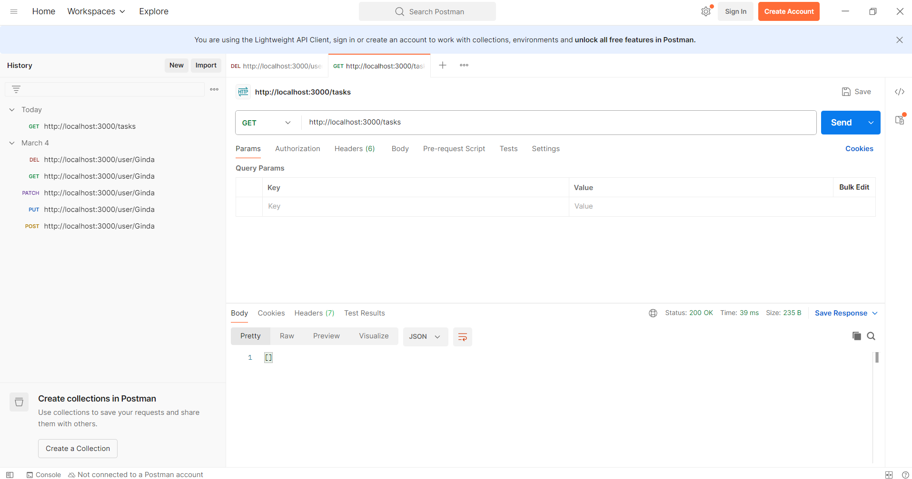
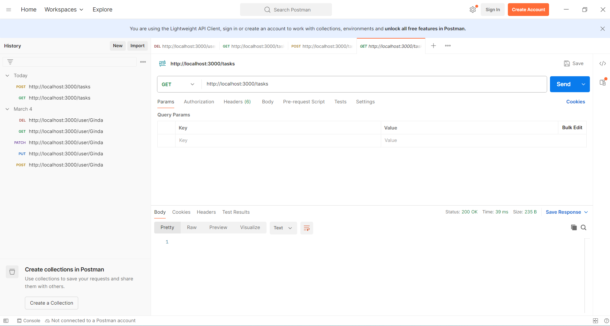
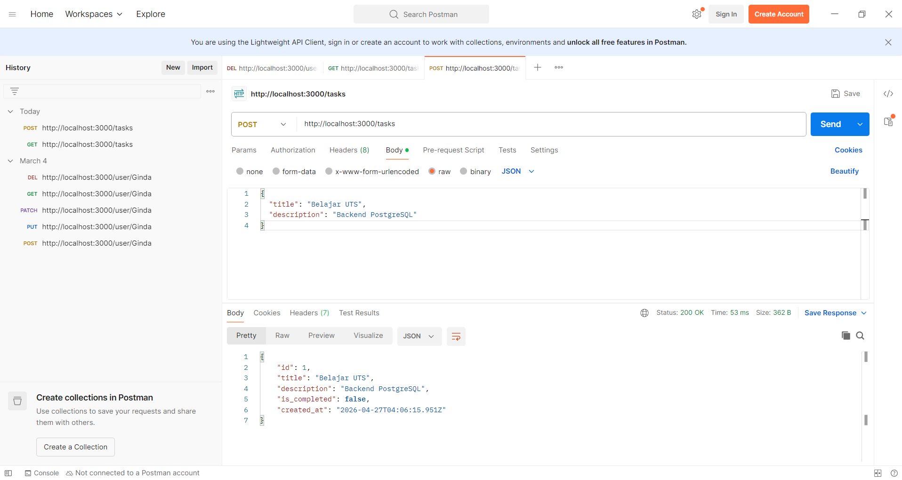
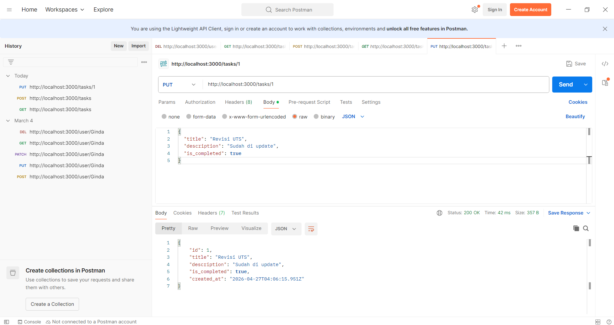
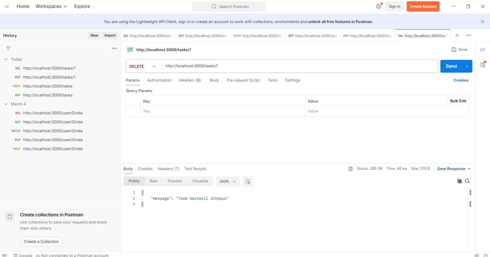

# UTS-WEB2-task-manager
Nama: Ginda Azahra
Nim: 23552011281
Kelas: TIF RM 23B

## Deskripsi
Backend sederhana menggunakan Node.js, Express, dan PostgreSQL.

## Fitur
- CRUD Tasks
- Validasi input
- Error handling
- Logging middleware

## Endpoint
- GET /tasks
- GET /tasks/:id
- POST /tasks
- PUT /tasks/:id
- DELETE /tasks/:id

## Cara Menjalankan
1. npm install
2. npm start

## Screenshot

### GET /tasks

### POST /tasks

### PUT /tasks

### DELETE /tasks
